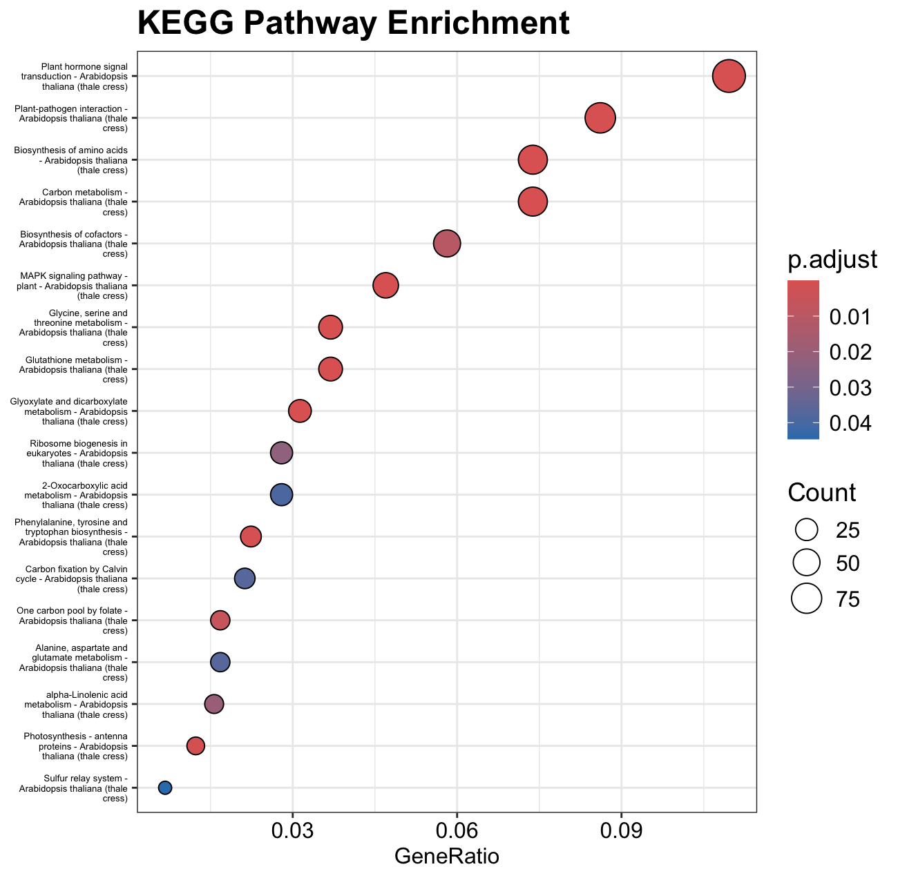

# **Stage 2 Report:** UV stress in the vasculature of *A. thaliana* leaf

Name: Chairunnisa Nur Amanda

Slack ID: @ChairunnisaAmanda

Github Repository:

Linkedin Post: 

---

# **Executive Summary**

The leaf vasculature of *Arabidopsis thaliana* plays a critical role in distributing signals during stress responses. To reveal genes responsive to UV-C treatment, we performed RNA-seq differential expression analysis on laser-captured vasculature samples from Berkowitz *et al.* (2021). Three biological replicates of UV-C–treated tissue were compared to water-treated controls. The pipeline combined Bash-based preprocessing (download → QC → trimming → alignment → counting) and R/DESeq2 analysis (normalisation, differential expression, enrichment). 

---

# **1. Introduction & Background**

Plants constantly experience environmental challenges such as ultraviolet (UV) radiation. The vasculature is not merely a conduit for transport but also a signalling hub coordinating gene expression during stress. Berkowitz *et al.* generated a tissue-resolved transcriptome of *Arabidopsis* leaves exposed to diverse stresses.

Here, we focus exclusively on UV-C treatment in the vasculature to identify:

1. Differentially expressed (DE) genes between UV-C and water controls.
2. Enriched Gene Ontology (GO) terms and KEGG pathways representing key biological responses.

---

# **2. Methods**

The workflow consisted of:

1. Data Acquisition & QC (Bash)
2. Reference Genome Preparation
3. Read Mapping & Counting
4. Differential Expression & Enrichment (R)

| Step | Script | Purpose |
| --- | --- | --- |
| Download | `01_download.sh` | Fetch raw FASTQ from SRA (3 controls, 3 treated). |
| Raw QC | `02_raw_qc.sh` | FastQC + MultiQC to assess read quality before trimming. |
| Trimming | `03_trim_and_qc.sh` | fastp to remove adapters/low-quality bases and re-QC. |
| Indexing | `genome_index.sh` | Download TAIR10 reference & build STAR index. |
| Mapping | `04_mapping_star.sh` | STAR single-end alignment, output sorted BAM + index. |
| Counting | `05_counting.sh` | featureCounts to generate a count matrix for DESeq2. |

**Key notes**

- `fastp` HTML/JSON reports summarise base quality, duplication, and adapter removal.
- `STAR` was run in single-end mode with default splice-aware settings for plant genomes.
- `featureCounts` used the Ensembl Plants TAIR10 GFF3 with `t gene -g ID` to obtain gene-level counts.

## 1) Bash pipeline (download → QC → Mapping → counts)

### 1. Create Directory

```bash
mkdir -p raw_fastq trimmed star_index alignments counts
```

### 2. Download

Fetch raw FASTQ from SRA (3 controls, 3 treated).

```bash
#!/usr/bin/bash
# 1) Download Samples
# Script: 01_download.sh
# Description: download control and treated sample according to lists
echo "### Downloading samples"
curl -L ftp://ftp.sra.ebi.ac.uk/vol1/fastq/SRR128/027/SRR12808527/SRR12808527.fastq.gz -o raw_fastq/ctl_1.fastq.gz
curl -L ftp://ftp.sra.ebi.ac.uk/vol1/fastq/SRR128/028/SRR12808528/SRR12808528.fastq.gz -o raw_fastq/ctl_2.fastq.gz
curl -L ftp://ftp.sra.ebi.ac.uk/vol1/fastq/SRR128/029/SRR12808529/SRR12808529.fastq.gz -o raw_fastq/ctl_3.fastq.gz
curl -L ftp://ftp.sra.ebi.ac.uk/vol1/fastq/SRR128/099/SRR12808499/SRR12808499.fastq.gz -o raw_fastq/uvc_3.fastq.gz
curl -L ftp://ftp.sra.ebi.ac.uk/vol1/fastq/SRR128/098/SRR12808498/SRR12808498.fastq.gz -o raw_fastq/uvc_2.fastq.gz
curl -L ftp://ftp.sra.ebi.ac.uk/vol1/fastq/SRR128/097/SRR12808497/SRR12808497.fastq.gz -o raw_fastq/uvc_1.fastq.gz
```

### 3. QC

FastQC + MultiQC to assess read quality before trimming.

```bash
#!/usr/bin/bash
# Script: 02_raw_qc.sh
# Description: Run FastQC on raw sequencing data for initial quality assessment.

# Set directories for clarity
RAW_DATA_DIR="raw_fastq"
QC_OUTPUT_DIR="results/raw_fastqc_reports"

# Create the output directory if it doesn't exist
echo "Creating output directory: $QC_OUTPUT_DIR"
mkdir -p "$QC_OUTPUT_DIR"

# Check if the raw data directory exists and has files
if [ ! -d "$RAW_DATA_DIR" ]; then
    echo "Error: Raw data directory $RAW_DATA_DIR not found!"
    exit 1
fi

if [ -z "$(ls -A $RAW_DATA_DIR/*.fastq.gz 2>/dev/null)" ]; then
    echo "Error: No FASTQ files found in $RAW_DATA_DIR!"
    exit 1
fi

echo "Starting FastQC analysis on raw data in $RAW_DATA_DIR..."
echo "Output will be saved to: $QC_OUTPUT_DIR"

# Run FastQC on all gzipped FASTQ files in the raw data directory
fastqc "$RAW_DATA_DIR"/*.fastq.gz \
  --outdir "$QC_OUTPUT_DIR" \
  --quiet

echo "FastQC analysis complete."
echo "Individual reports are in: $QC_OUTPUT_DIR"

# Generate a consolidated MultiQC report for easy viewing
echo "Generating MultiQC report..."
multiqc "$QC_OUTPUT_DIR" \
  --outdir "$QC_OUTPUT_DIR" \
  --filename "multiqc_report_raw.html" \
  --quiet

echo "MultiQC report generated: $QC_OUTPUT_DIR/multiqc_report_raw.html"
echo "Raw data quality assessment step finished successfully."
```

### 4. Trim and QC

fastp to remove adapters/low-quality bases and re-QC.

```bash
#!/usr/bin/bash
# Script: 03_trim_and_qc.sh
# Description: Perform trimming with fastp followed by quality control (FastQC + MultiQC)
#              for single-end (transcriptome) FASTQ files.

# Directories
RAW_DATA_DIR="raw_fastq"
TRIMMED_DATA_DIR="trimmed"
FASTP_REPORT_DIR="results/fastp_reports"
TRIMMED_QC_DIR="results/trimmed_fastqc_reports"

# Create output directories
echo "Creating output directories..."
mkdir -p "$TRIMMED_DATA_DIR" "$FASTP_REPORT_DIR" "$TRIMMED_QC_DIR"

# Check for input files
if [ -z "$(ls -A $RAW_DATA_DIR/*.fastq.gz 2>/dev/null)" ]; then
    echo "Error: No FASTQ files found in $RAW_DATA_DIR!"
    exit 1
fi

echo "STEP 1: TRIMMING WITH FASTP"
echo "Input directory : $RAW_DATA_DIR"
echo "Output directory: $TRIMMED_DATA_DIR"

sample_count=0
for fq in "$RAW_DATA_DIR"/*.fastq.gz; do
    base_name=$(basename "$fq" .fastq.gz)
    sample_count=$((sample_count + 1))
    echo "Processing sample $sample_count: $base_name"

    # Run fastp for single-end data
    fastp \
        -i "$fq" \
        -o "${TRIMMED_DATA_DIR}/${base_name}_trimmed.fastq.gz" \
        --html "${FASTP_REPORT_DIR}/${base_name}_fastp.html" \
        --json "${FASTP_REPORT_DIR}/${base_name}_fastp.json" \
        --thread 4

    echo "Completed: $base_name"
done

echo ""
echo "Trimming completed! Processed $sample_count samples."
echo "Trimmed files saved to: $TRIMMED_DATA_DIR"

# ── Quality control on trimmed reads ─────────────────────────────────────────
if [ -z "$(ls -A $TRIMMED_DATA_DIR/*.fastq.gz 2>/dev/null)" ]; then
    echo "Error: No trimmed files were produced!"
    exit 1
fi

echo ""
echo "STEP 2: QUALITY CONTROL ON TRIMMED DATA"
fastqc "$TRIMMED_DATA_DIR"/*.fastq.gz \
  --outdir "$TRIMMED_QC_DIR" \
  --threads 4

# ── Consolidate reports with MultiQC ─────────────────────────────────────────
echo "Generating MultiQC report..."
multiqc "$TRIMMED_QC_DIR" \
  --outdir "$TRIMMED_QC_DIR" \
  --filename "multiqc_report_trimmed.html"

echo ""
echo "=== SUMMARY ==="
echo "✓ Trimming completed: $sample_count samples processed"
echo "✓ Quality assessment completed on trimmed data"
echo ""
echo "Output directories:"
echo "  - Trimmed FASTQ files : $TRIMMED_DATA_DIR"
echo "  - fastp reports       : $FASTP_REPORT_DIR"
echo "  - FastQC/MultiQC QC   : $TRIMMED_QC_DIR"
echo ""
echo "Script completed successfully!"

```

### 5. Download Reference

Download TAIR10 reference & build STAR index.

Link from Ensembl Plants of *Arabidopsis thaliana* genome:

https://ftp.ensemblgenomes.ebi.ac.uk/pub/plants/release-62/fasta/arabidopsis_thaliana/dna/Arabidopsis_thaliana.TAIR10.dna.toplevel.fa.gz 

```bash
#download genome
mkdir genome
wget https://ftp.ensemblgenomes.ebi.ac.uk/pub/plants/release-62/fasta/arabidopsis_thaliana/dna/Arabidopsis_thaliana.TAIR10.dna.toplevel.fa.gz 
gunzip [Arabidopsis_thaliana.TAIR10.dna.toplevel.fa.gz](https://ftp.ensemblgenomes.ebi.ac.uk/pub/plants/release-62/fasta/arabidopsis_thaliana/dna/Arabidopsis_thaliana.TAIR10.dna.toplevel.fa.gz)

# rename the file to a_thaliana.fa
mv [Arabidopsis_thaliana.TAIR10.dna.toplevel.fa](https://ftp.ensemblgenomes.ebi.ac.uk/pub/plants/release-62/fasta/arabidopsis_thaliana/dna/Arabidopsis_thaliana.TAIR10.dna.toplevel.fa.gz) a_thaliana.fa

# Create genome index directory
mkdir -p genomeIndex

# Build STAR genome index (FASTA only)
STAR --runMode genomeGenerate \
     --genomeDir genomeIndex \
     --genomeFastaFiles genome/a_thaliana.fa

```

### 6. Mapping with STAR

STAR single-end alignment, output sorted BAM + index.

```bash
#!/bin/bash
# Script: 04_mapping_star.sh
# Script for mapping Arabidopsis single-end reads with STAR
# and indexing BAM files for IGV

# Directories
GENOME_DIR="genome/genomeIndex"
TRIM_DIR="trimmed"
OUT_DIR="mapped"

mkdir -p $OUT_DIR

# 1. Run STAR alignment for each trimmed FASTQ
for infile in $TRIM_DIR/*.fq.gz ; do
    [ -e "$infile" ] || continue

    sample=$(basename "$infile" .fq.gz)
    echo ">>> Aligning sample: $sample"

    STAR --genomeDir $GENOME_DIR \
         --readFilesIn $infile \
         --readFilesCommand zcat \
         --outFileNamePrefix $OUT_DIR/${sample}_ \
         --outSAMtype BAM SortedByCoordinate \
         --outSAMattributes All
done

# 2. Index all BAMs for IGV
echo ">>> Indexing BAM files..."
for bam in $OUT_DIR/*Aligned.sortedByCoord.out.bam; do
    samtools index $bam
done

echo ">>> All alignments complete and indexed!"

```

### 7. Download Genome Annotation Files

Link from Ensembl Plants of *Arabidopsis thaliana* genome:

```bash
wget https://ftp.ensemblgenomes.ebi.ac.uk/pub/plants/release-62/gff3/arabidopsis_thaliana/Arabidopsis_thaliana.TAIR10.62.gff3.gz

gunzip Arabidopsis_thaliana.TAIR10.62.gff3.gz

mv Arabidopsis_thaliana.TAIR10.62.gff3.gz a_thaliana.gff3
```

### 8. Count

featureCounts to generate a count matrix for DESeq2.

```bash
#!/usr/bin/bash
# Script: 05_counting.sh
# Simple featureCounts script for Arabidopsis (single-end)
# Make sure subread/featureCounts is installed

# Create output directory
mkdir -p counts

# Run featureCounts
featureCounts -O -t gene -g ID -a a_thaliana.gff3 -o counts/counts.txt mapped/*_Aligned.sortedByCoord.out.bam
# Check the summary
cat counts/counts.txt.summary

```

# 2) DE analysis in R (DESeq2 + plots + top100 + enrichment)

```r
##############################################
# Differential expression analysis – Arabidopsis
# File Required: counts.txt  +  metadata.csv
##############################################

# 1. Set working directory
setwd("/Users/chairunnisanuramanda/Hackbio-2025/Hackbio-Internship-NGS-2025/Stage-2") # my working directory

# 2. Load libraries
library(DESeq2) # to perform differential expression analysis
library(pheatmap) # to visualise upregulated and downregulated genes in heatmap
library(dplyr) # to perform data manipulation
library(ggplot2) # to create plot for enrichment
library(clusterProfiler) # for enrichment analysis
library(org.At.tair.db)   # for Arabidopsis ID mapping

# 3. Read in data
counts <- read.delim("counts.txt", header = TRUE, comment.char = "#") # result from RNA-Seq Data Analysis
meta   <- read.csv("metadata.csv", header = TRUE, stringsAsFactors = TRUE) # metadata files that we create

# use regular expression to rename the column names to make it clear
colnames(counts) <- gsub("_trimmed_Aligned\\.sortedByCoord\\.out$", "", colnames(counts))

# Preview
head(counts)
head(meta)

# 4. Prepare count matrix
# Keep only columns of counts from samples in metadata
raw_counts <- counts[ , c(1, 7:12) ]

# Add gene IDs as rownames
rownames(raw_counts) <- counts$Geneid

# Remove the Gene id column
raw_counts <- raw_counts[ , -1 ]

# preview raw_counts
head(raw_counts)

# 5. Create DESeq2 dataset
# Design formula compares conditions (Control vs Treated)
meta$condition <- factor(meta$condition, levels = c("control", "treated"))
dds <- DESeqDataSetFromMatrix(countData = raw_counts,
                              colData   = meta,
                              design    = ~ condition)

dds$condition <- relevel(dds$condition, ref = "control")

# 6. Run differential expression
dds <- DESeq(dds)
res <- results(dds)    

# Inspect results
head(res)
summary(res)

# 7. Volcano plot
plot(res$log2FoldChange,
     -log10(res$padj),
     pch = 19, cex = 0.4,
     col = "grey",
     xlab = "Log2 Fold Change (UV-C Treated vs Control)",
     ylab = "-log10 Adjusted P-value",
     main = "Volcano Plot")
abline(v = c(-1, 1), lty = 2, col = "blue")
abline(h = -log10(0.05), lty = 2, col = "red")

# Highlight significant genes
# log2(fold change) > 1 and FDR < 0.05 (according to the paper)
up   <- subset(res, padj < 0.05 & log2FoldChange > 1)
down <- subset(res, padj < 0.05 & log2FoldChange < -1)
points(up$log2FoldChange,   -log10(up$padj),   col="salmon",    pch=19, cex=0.5)
points(down$log2FoldChange, -log10(down$padj), col="lightblue", pch=19, cex=0.5)

# 8. Heatmap of DE genes
# combine up & down for visualization
de_genes <- c(rownames(up), rownames(down))

# create heatmap
if (length(de_genes) > 2) {
  pheatmap(raw_counts[de_genes, ],
           scale = "row",
           show_rownames = FALSE,
           clustering_distance_rows = "euclidean",
           clustering_distance_cols = "euclidean",
           main = "DE Genes (scaled)")
}

# Create a clear heatmap for Top 50 DE Genes
# reorder columns
ordered_cols <- c("ctl_1","ctl_2","ctl_3","uvc_1","uvc_2","uvc_3")

# Sample treatment information
sample_group <- data.frame(
  Treatment = c("Control","Control","Control","UV-C","UV-C","UV-C")
)
ann_colors <- list(
  Treatment = c("Control" = "skyblue", "UV-C" = "tomato")
)

# treatment to sample names
row.names(sample_group) <- colnames(raw_counts) 

# Create heatmap
top <- head(order(res$padj), 50)
pheatmap(raw_counts[top, ordered_cols],
         scale = "row",
         cluster_cols = FALSE,
         fontsize_row = 6, 
         annotation_col = sample_group[ordered_cols, , drop=FALSE],
         annotation_colors = ann_colors,
         main = "Top 50 DE Genes (grouped by treatment)")

# 9. Filter Top 100 Differentially Expressed Genes
# Filter with |log2FC| > 2.5 and FDR < 0.05
res_filtered <- res %>%
  as.data.frame() %>%
  filter(!is.na(padj)) %>%
  filter(abs(log2FoldChange) > 2.5, padj < 0.05)

# Sort by adjusted p-value (or |log2FC|)
top100 <- res_filtered %>%
  arrange(padj) %>%
  head(100)

head(top100)

# 10. Enrichment Analysis
# Get the gene IDs DE result
de_genes <- rownames(top100)

# Map to Entrez IDs for KEGG and GO
entrez <- mapIds(org.At.tair.db,
                 keys = gsub("gene:", "", de_genes), # strip "gene:"
                 column = "ENTREZID",
                 keytype = "TAIR",
                 multiVals = "first")

# drop NAs
entrez_ids <- na.omit(entrez)
length(entrez_ids)

# GO: Biological Process
ego_bp <- enrichGO(gene       = entrez_ids,
                OrgDb         = org.At.tair.db,
                keyType       = "ENTREZID",
                ont           = "BP",         # Biological Process
                pAdjustMethod = "BH",
                pvalueCutoff  = 0.05,
                qvalueCutoff  = 0.05,
                readable      = TRUE) 

# Plot
dotplot(ego_bp, showCategory = 20) +
  ggtitle("GO Enrichment: Biological Process") +
  theme(
    plot.title   = element_text(size = 18, face = "bold"),
    axis.text.x  = element_text(size = 12),
    axis.text.y  = element_text(size = 10),
    legend.text  = element_text(size = 12),
    legend.title = element_text(size = 14)
  )

# GO: Cellular Component
ego_cc <- enrichGO(gene       = entrez_ids,
                OrgDb         = org.At.tair.db,
                keyType       = "ENTREZID",
                ont           = "CC",         # Biological Process
                 pAdjustMethod = "BH",
                pvalueCutoff  = 0.05,
                qvalueCutoff  = 0.05,
                readable      = TRUE) 

# Plot
dotplot(ego_cc, showCategory = 20) +
  ggtitle("GO Enrichment: Cellular Component") +
  theme(
    plot.title   = element_text(size = 18, face = "bold"),
    axis.text.x  = element_text(size = 12),
    axis.text.y  = element_text(size = 10),
    legend.text  = element_text(size = 12),
    legend.title = element_text(size = 14)
  )

# GO: Molecular Function
ego_mf <- enrichGO(gene       = entrez_ids,
                   OrgDb         = org.At.tair.db,
                   keyType       = "ENTREZID",
                   ont           = "MF",         # Biological Process
                   pAdjustMethod = "BH",
                   pvalueCutoff  = 0.05,
                   qvalueCutoff  = 0.05,
                   readable      = TRUE) 

# Plot
dotplot(ego_mf, showCategory = 20) +
  ggtitle("GO Enrichment: Molecular Function") +
  theme(
    plot.title   = element_text(size = 18, face = "bold"),
    axis.text.x  = element_text(size = 12),
    axis.text.y  = element_text(size = 8),
    legend.text  = element_text(size = 12),
    legend.title = element_text(size = 14)
  )

# Write csv for top 20 GO result
# Convert to data frames and take top 20
bp_df <- head(as.data.frame(ego_bp), 20)
cc_df <- head(as.data.frame(ego_cc), 20)
mf_df <- head(as.data.frame(ego_mf), 20)

# Add a column to indicate the ontology
bp_df$Ontology <- "BP"
cc_df$Ontology <- "CC"
mf_df$Ontology <- "MF"

# Combine into one table
go_top20 <- rbind(bp_df, cc_df, mf_df)

# KEGG Pathway Analysis
# Clean TAIR IDs
tair_ids <- sub("^gene:", "", rownames(res))
de_tair  <- tair_ids[res$padj < 0.05 & abs(res$log2FoldChange) > 1]

# Run KEGG enrichment using TAIR IDs
kegg_res <- enrichKEGG(gene         = de_tair,
                       organism     = "ath",
                       keyType      = "kegg", 
                       pAdjustMethod= "BH",
                       qvalueCutoff = 0.05)

# Create plot
dotplot(kegg_res, showCategory = 20) +
  ggtitle("KEGG Pathway Enrichment") +
  theme(
    plot.title   = element_text(size = 18, face = "bold"),
    axis.text.x  = element_text(size = 12),
    axis.text.y  = element_text(size = 5),
    legend.text  = element_text(size = 12),
    legend.title = element_text(size = 14)
  )

# View top 5 pathways
top5_pathways <- kegg_res@result %>%
  arrange(p.adjust) %>%
  head(5)

# 11. Save outputs
write.csv(res,         "all_results.csv")
write.csv(up,          "upregulated.csv")
write.csv(down,        "downregulated.csv")
write.csv(raw_counts,  "raw_counts.csv")
write.csv(top100, "top100_DE_genes.csv", row.names = TRUE)
write.csv(top5_pathways, "top5_pathways.csv", row.names = FALSE)
write.csv(go_top20, "GO_top20_BP_CC_MF.csv", row.names = FALSE)

```

---

# **4) Results and Discussion**

### 4.1 Volcano Plot


**Volcano plot of differentially expressed genes (DEGs) after UVC treatment**

The volcano plot displays the distribution of genes according to log₂ fold change (UVC treated vs. control) on the x-axis and –log₁₀ adjusted p-value on the y-axis.

Red points represent significantly upregulated genes in UVC-treated samples, while blue points indicate downregulated genes (FDR < 0.05).

The predominance of red points reflects a strong transcriptional activation in response to UVC exposure.

### 4.2 Heatmap of Upregulated and Downregulated Genes


**Heatmap of all significant DEGs**

Hierarchical clustering of all DEGs shows a clear separation between UVC-treated and control groups.

The color scale represents z-score normalized expression levels, with red indicating higher expression and blue indicating lower expression.

UVC-treated samples cluster together and exhibit widespread gene activation compared to controls, demonstrating the global impact of UVC irradiation.


The top 50 most significantly regulated genes are shown, grouped by treatment.

### 4.1 Gene Ontology (GO) Enrichment

Functional enrichment of the differentially expressed genes (DEGs) following UVC treatment revealed significant activation of stress-related pathways across Biological Process (BP), Cellular Component (CC), and Molecular Function (MF) categories.

The top 20 GO terms (Table 1) were dominated by processes associated with hypoxia and oxidative stress, including *response to hypoxia*, *response to decreased oxygen levels*, *response to oxidative stress*, and *response to reactive oxygen species*. These terms indicate that UVC irradiation triggered a strong cellular stress response, likely due to the generation of reactive oxygen species (ROS) and disruption of normal oxygen homeostasis [1, 2].

Other enriched BP terms such as *response to wounding*, *response to jasmonic acid*, and *regulation of defense response* further reflect damage recognition and defense activation, consistent with UVC-induced DNA damage and cellular injury.

In the CC category, enrichment in *cytoplasmic stress granule*, *ribonucleoprotein granule*, and *apoplast* suggests structural reorganization to protect mRNA and proteins during stress [4]. The MF category highlighted *ATPase-coupled transmembrane transporter activity*, *glutathione transferase activity*, and *ABC-type xenobiotic transporter activity*, all of which are critical for detoxification, antioxidant defense, and energy-dependent transport to counteract UVC-induced oxidative damage.

These results indicate that UVC exposure activates hypoxia signaling, ROS detoxification, and hormone-mediated defense networks, enabling cells to maintain redox balance and repair damage caused by ultraviolet irradiation [5].

***Table 1. Top 20 GO Terms for all 3 Categories***

| Description | Ontology | Count |
| --- | --- | --- |
| response to hypoxia | BP | 17 |
| response to decreased oxygen levels | BP | 17 |
| response to oxygen levels | BP | 17 |
| cellular response to hypoxia | BP | 15 |
| cellular response to decreased oxygen levels | BP | 15 |
| cellular response to oxygen levels | BP | 15 |
| response to wounding | BP | 15 |
| response to oxidative stress | BP | 16 |
| indole-containing compound metabolic process | BP | 8 |
| toxin metabolic process | BP | 7 |
| response to jasmonic acid | BP | 10 |
| response to fatty acid | BP | 10 |
| response to water deprivation | BP | 13 |
| response to fungus | BP | 12 |
| response to water | BP | 13 |
| regulation of defense response | BP | 10 |
| response to reactive oxygen species | BP | 8 |
| camalexin biosynthetic process | BP | 4 |
| camalexin metabolic process | BP | 4 |
| toxin biosynthetic process | BP | 4 |
| cytoplasmic stress granule | CC | 5 |
| cytoplasmic ribonucleoprotein granule | CC | 5 |
| ribonucleoprotein granule | CC | 5 |
| apoplast | CC | 6 |
| supramolecular complex | CC | 6 |
| ABC-type xenobiotic transporter activity | MF | 3 |
| peptide binding | MF | 5 |
| glutathione binding | MF | 3 |
| oligopeptide binding | MF | 3 |
| ATP hydrolysis activity | MF | 9 |
| glutathione transferase activity | MF | 4 |
| quercetin 7-O-glucosyltransferase activity | MF | 4 |
| amide binding | MF | 5 |
| ATPase-coupled transmembrane transporter activity | MF | 6 |
| xenobiotic transmembrane transporter activity | MF | 4 |
| quercetin 3-O-glucosyltransferase activity | MF | 4 |
| primary active transmembrane transporter activity | MF | 6 |
| modified amino acid binding | MF | 3 |
| sulfur compound binding | MF | 3 |
| ABC-type transporter activity | MF | 4 |
| daphnetin 3-O-glucosyltransferase activity | MF | 2 |
| myricetin 3-O-glucosyltransferase activity | MF | 2 |
| flavonol 3-O-glucosyltransferase activity | MF | 2 |
| dioxygenase activity | MF | 4 |
| transaminase activity | MF | 3 |


### 4.2 KEGG Pathway

Kyoto Encyclopedia of Genes and Genomes (KEGG) pathway analysis further supported the stress-response pattern of the GO results. The top five enriched pathways (Table 2) included *Plant–pathogen interaction*, *Plant hormone signal transduction*, and *Glutathione metabolism*, reflecting key mechanisms for pathogen defense, hormonal regulation, and redox homeostasis [6].

Notably, *Biosynthesis of amino acids* and *Glycine, serine and threonine metabolism* were also enriched, suggesting that primary metabolic adjustments may support the production of defense-related metabolites and signaling molecules [7].

The enrichment of *Plant–pathogen interaction* and *Plant hormone signal transduction* pathways underscores the interplay between environmental adaptation and immune responses, while *Glutathione metabolism* highlights the importance of antioxidant activity in mitigating oxidative stress [8].

***Table 2. Top 5 KEGG Pathway***

| category | subcategory | ID | Description |
| --- | --- | --- | --- |
| Organismal Systems | Environmental adaptation | ath04626 | Plant-pathogen interaction - Arabidopsis thaliana (thale cress) |
| Metabolism | Amino acid metabolism | ath00260 | Glycine, serine and threonine metabolism - Arabidopsis thaliana (thale
  cress) |
| Metabolism | Global and overview maps | ath01230 | Biosynthesis of amino acids - Arabidopsis thaliana (thale cress) |
| Environmental Information Processing | Signal transduction | ath04075 | Plant hormone signal transduction - Arabidopsis thaliana (thale cress) |
| Metabolism | Metabolism of other amino acids | ath00480 | Glutathione metabolism - Arabidopsis thaliana (thale cress) |



---

# **5) Conclusion**

This project demonstrated how RNA-seq can reveal the global molecular response of *Arabidopsis thaliana* to UV-C treatment. Differential expression analysis uncovered thousands of genes involved in hypoxia signaling, oxidative stress detoxification, hormone-mediated defense, and primary metabolic adjustment. GO and KEGG enrichment connected these genes to key pathways such as plant–pathogen interaction, glutathione metabolism, and amino-acid biosynthesis, highlighting coordinated antioxidant and immune strategies. Through this workflow I learned to integrate quality control, statistical testing, visualization, and functional annotation in R, gaining a deeper understanding of transcriptomic data analysis and the biological complexity of plant stress adaptation.

***References:***

1. Desikan, R., A-H-Mackerness, S., Hancock, J. T., & Neill, S. J. (2001). Regulation of the Arabidopsis transcriptome by oxidative stress. *Plant physiology*, *127*(1), 159–172. https://doi.org/10.1104/pp.127.1.159
2. Licausi, F., & Perata, P. (2009). Low oxygen signaling and tolerance in plants. *Advances in Botanical Research*, *50*, 139-198.
3. Hartmann, A., Berkowitz, O., Whelan, J. *et al.* Cross-species transcriptomic analyses reveals common and opposite responses in Arabidopsis, rice and barley following oxidative stress and hormone treatment. *BMC Plant Biol* **22**, 62 (2022). https://doi.org/10.1186/s12870-021-03406-7
4. Hemme, D., Veyel, D., Mühlhaus, T., Sommer, F., Jüppner, J., Unger, A. K., ... & Schroda, M. (2014). Systems-wide analysis of acclimation responses to long-term heat stress and recovery in the photosynthetic model organism Chlamydomonas reinhardtii. *The Plant Cell*, *26*(11), 4270-4297.
5. Chen, Z., Dong, Y., & Huang, X. (2022). Plant responses to UV-B radiation: signaling, acclimation and stress tolerance. *Stress biology*, *2*(1), 51. https://doi.org/10.1007/s44154-022-00076-9
6. Apel, K., & Hirt, H. (2004). Reactive oxygen species: metabolism, oxidative stress, and signal transduction. *Annu. Rev. Plant Biol.*, *55*(1), 373-399.
7. Less, H., & Galili, G. (2008). Principal transcriptional programs regulating plant amino acid metabolism in response to abiotic stresses. *Plant physiology*, *147*(1), 316-330.
8. Christine H. Foyer, Graham Noctor, Ascorbate and Glutathione: The Heart of the Redox Hub, *Plant Physiology*, Volume 155, Issue 1, January 2011, Pages 2–18, https://doi.org/10.1104/pp.110.167569
9. Berkowitz, O., Xu, Y., Liew, L. C., Wang, Y., Zhu, Y., Hurgobin, B., Lewsey, M. G., & Whelan, J. (2021). RNA-seq analysis of laser microdissected Arabidopsis thaliana leaf epidermis, mesophyll and vasculature defines tissue-specific transcriptional responses to multiple stress treatments. *The Plant journal : for cell and molecular biology*, *107*(3), 938–955. https://doi.org/10.1111/tpj.15314
